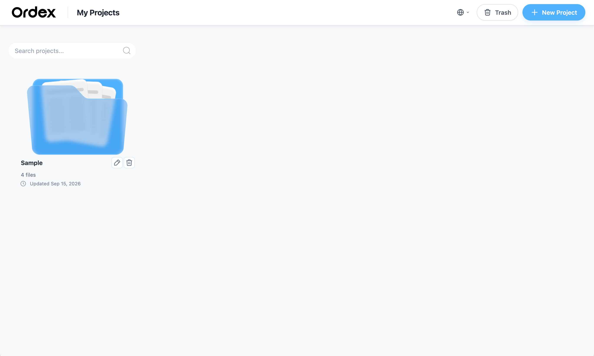
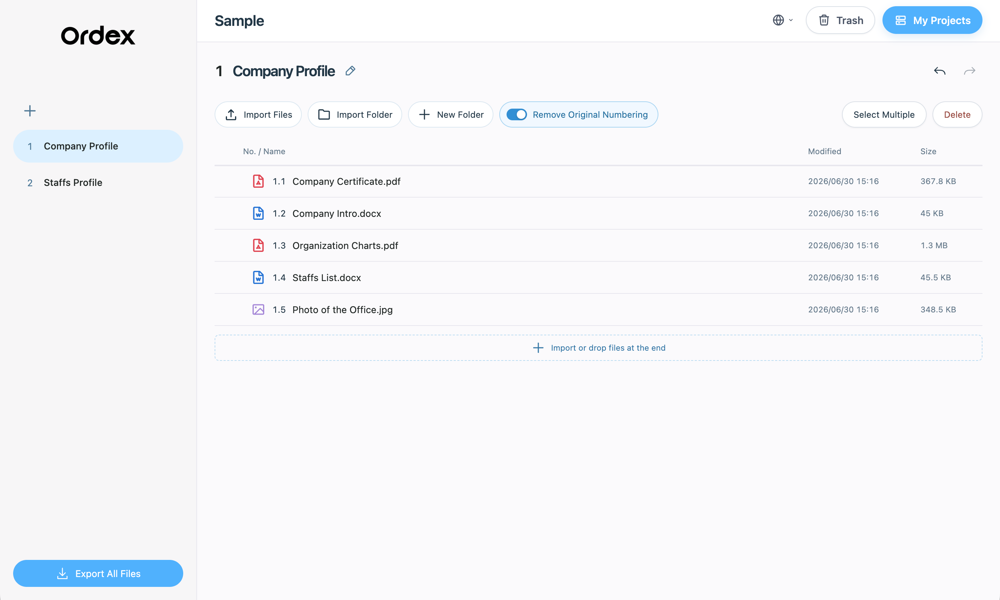
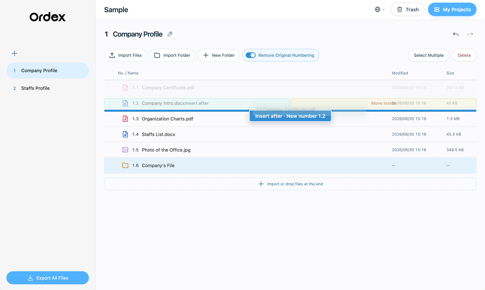
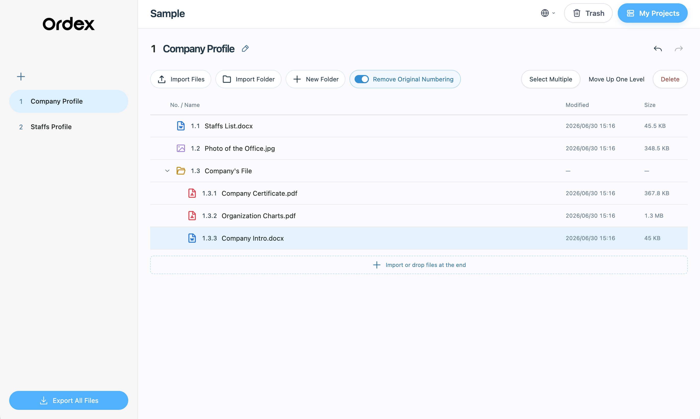
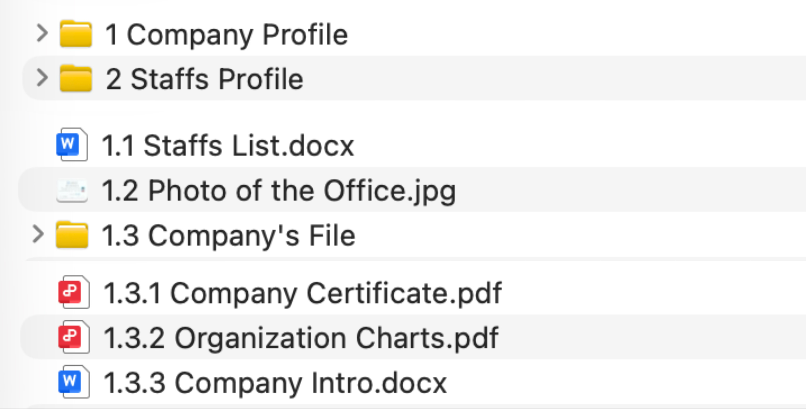

<div align="center">
  

  <h1>Ordex</h1>
  <p>Free, offline desktop file organizer for macOS and Windows.</p>

  <p><a href="README.zh-CN.md">中文</a> · <strong>English</strong></p>
</div>

Ordex is a free, open-source file organizer that works offline: drag files and folders into order, get automatic multilevel numbering, and export a ZIP with the final numbers in its filenames. Numbers update as you add, remove, or move items, so you never have to renumber everything by hand; your original files remain untouched.

[Download the initial Mac / Windows release](https://github.com/clorisHHH/ordex/releases/tag/v1.0.0)

## Walkthrough

These screenshots show the English interface. Use the globe icon in the upper-right corner to switch between 中文 and English. The sample shown here is not included in the installers.

1. **My Projects** — Create, find, and open projects.

   

2. **Automatic numbering** — Imported files receive multilevel numbers based on their current order.

   

3. **Guided drag and drop** — While dragging, Ordex shows the drop position and resulting number.

   

4. **Nested folder ordering** — Sort folders and their contents while keeping the numbered hierarchy clear.

   

5. **Numbered export** — Exported copies have their final numbers in file and folder names; originals remain unchanged.

   

## Features

- The user chooses a local save location when creating a project
- Importing files copies them without moving or modifying the originals
- Up to five levels of numeric numbering with drag-and-drop reordering
- File and folder deletion, recovery, and permanent deletion of individual items
- Turn removing original numbering on or off at any time, and restore complete original filenames
- Chinese and English interface switching; native Quick Look on Mac and in-app space preview on Windows
- The desktop version runs completely offline and does not depend on cloud services
- Packaging scripts for macOS Apple Silicon and Windows x64

## Data and privacy

The screenshots in the repository are for interface demonstration only; they do not contain user project data, the actual files from the demo projects shown in the screenshots, videos, audio, or installers.

The desktop version stores the project index in the local Ordex settings directory. File copies and `.ordex` organization data are stored in the project folder selected by the user.

New users see an empty “My Projects” page on first launch.

## Local development

Node.js 20+ and pnpm are required.

```bash
pnpm install
pnpm dev
```

## Testing and building

```bash
pnpm test
pnpm build
```

Build output is generated in `dist/` and is not committed to the repository.

## Running the desktop version

First build the frontend, then launch Electron from the project:

```bash
pnpm build
pnpm exec electron desktop/main.cjs
```

## Packaging

macOS Apple Silicon:

```bash
python3 desktop/package.py
```

The Windows x64 packaging script is `desktop/package-windows.py`. Packaging output, downloaded Electron runtimes, and temporary directories are ignored by Git. The Windows installer lets users choose an installation directory and whether to create a desktop shortcut; the default installation location is `%LOCALAPPDATA%\Programs\Ordex`. Ordex can be uninstalled from the Start menu through `Uninstall Ordex` or from Windows “Installed apps”.

## Third-party components

The project includes Rare UI, Uiverse, MingCute icons, and an offline file preview component. The corresponding MIT / Apache 2.0 licenses and notices are listed in [THIRD_PARTY_NOTICES.md](THIRD_PARTY_NOTICES.md); desktop installers include the license text.

Uninstalling the software does not automatically delete project folders or Ordex settings data.

The initial installers were not notarized with an Apple Developer ID or signed with a commercial Windows code-signing certificate; systems may show a security warning after downloading. Release notes include SHA-256 checksums. Windows installation and runtime have been verified on real hardware; unsigned-system prompts still require the downloader to confirm them.

## License

Ordex is open-sourced under the [MIT License](LICENSE).
