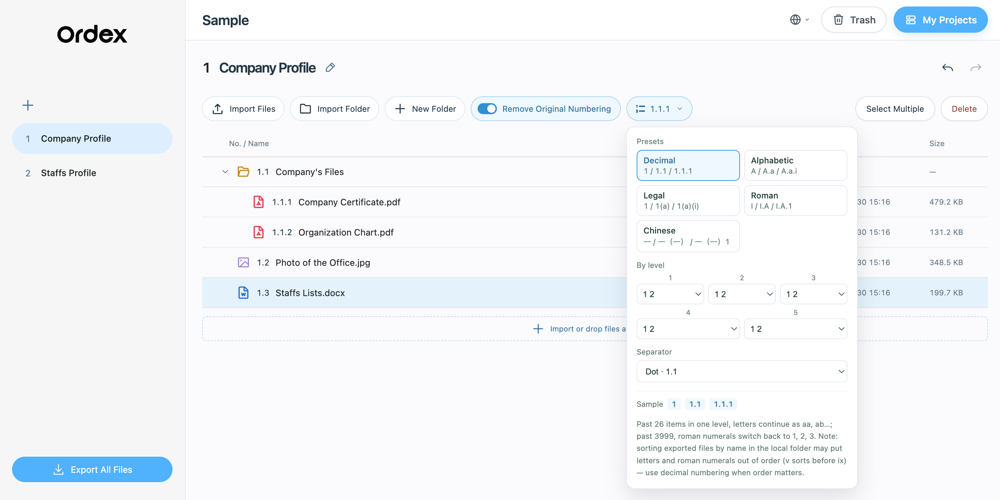

<div align="center">
  

  <h1>Ordex</h1>
  <p>免费、离线可用的 macOS 和 Windows 桌面文件顺序编排工具。</p>

  <p><strong>中文</strong> · <a href="README.md">English</a></p>
</div>

Ordex 是一款免费开源、离线可用的文件顺序编排工具：拖拽即可调整文件和文件夹顺序，自动生成多级编号，并一键导出按编号命名的资料包。增删或移动文件后，编号会随顺序自动更新，无须逐个重命名，也不会改动你的原文件。

两个版本并存，操作方式完全一致，可按需要选择：

- **[2.0.0（最新）](https://github.com/clorisHHH/ordex/releases/tag/v2.0.0)** — 可切换编号形式：`a b c`、`i ii iii`、`一 二 三` 及括号形式，可逐层设置；另支持多选批量移出上一层。默认仍为数字编号。
- **[1.0.0（首发版）](https://github.com/clorisHHH/ordex/releases/tag/v1.0.0)** — 只有纯数字编号。

## 操作示例

以下截图使用英文界面；点击右上角地球图标可切换中文或 English。截图仅展示示例，不包含在安装包中。

1. **我的项目** — 创建、查找并打开项目。

   

2. **自动编号** — 导入文件后，Ordex 按当前顺序显示多级编号。

   

3. **编号模式（2.0 新增）** — 点击工具栏编号按钮打开编号选项面板，可切换 `a b c`、`i ii iii`、`一 二 三` 等形式，并按层级与分隔符自由组合，示例实时预览。

   

4. **拖拽指引** — 拖动时显示放置位置和变更后的编号。

   

5. **文件夹内排序** — 文件夹及其内部文件可以分别排序，层级编号一目了然。

   

6. **编号导出** — 导出的副本按最终顺序命名，文件和文件夹都带有编号；原文件不变。

   

## 特性

- 新建项目时由用户选择本地保存位置
- 导入文件时复制副本，不移动或修改原文件
- 最多五级编号（数字 / 字母 / 罗马数字 / 中文等可切换）与拖拽重排
- 文件和文件夹删除、恢复及单项永久删除
- 可随时开启或关闭去除原编号，并恢复完整原始文件名
- 中英文界面切换；Mac 使用原生 Quick Look，Windows 使用软件内空格预览
- 桌面版完全离线运行，不依赖云端服务
- macOS Apple Silicon 与 Windows x64 打包脚本

## 数据与隐私

仓库中的截图仅用于展示界面；不包含用户项目数据、截图中演示项目的实际文件、视频、音频或安装包。

桌面版将项目索引保存在本机 Ordex 设置目录中，文件副本和 `.ordex` 编排数据保存在用户选择的项目文件夹。

新用户首次运行时看到的是空的“我的项目”页面。

## 本地开发

需要 Node.js 20+ 和 pnpm。

```bash
pnpm install
pnpm dev
```

## 测试与构建

```bash
pnpm test
pnpm build
```

构建产物生成在 `dist/`，不会提交到仓库。

## 运行桌面版

先生成前端构建，再用项目内的 Electron 启动：

```bash
pnpm build
pnpm exec electron desktop/main.cjs
```

## 打包

macOS Apple Silicon：

```bash
python3 desktop/package.py
```

Windows x64 打包脚本为 `desktop/package-windows.py`。打包产物、下载的 Electron 运行时和临时目录均被 Git 忽略。Windows 安装向导可选择安装目录及是否创建桌面快捷方式；默认安装在 `%LOCALAPPDATA%\Programs\Ordex`。可从开始菜单的 `Uninstall Ordex` 或 Windows“已安装的应用”卸载。

## 第三方组件

项目包含 Rare UI、Uiverse、MingCute 图标和离线文件预览组件。相应的 MIT / Apache 2.0 许可及说明见 [THIRD_PARTY_NOTICES.md](THIRD_PARTY_NOTICES.md)；桌面安装包附带许可证文本。

软件卸载不会自动删除项目目录或 Ordex 设置数据。

首发安装包未使用 Apple Developer ID 公证或 Windows 商业代码签名；从网络下载后，系统可能显示安全提示。发布说明附带 SHA-256 校验值。Windows 安装与运行已在实机验证；未签名的系统提示仍需下载者自行确认。

## 许可证

Ordex 采用 [MIT License](LICENSE) 开源。
